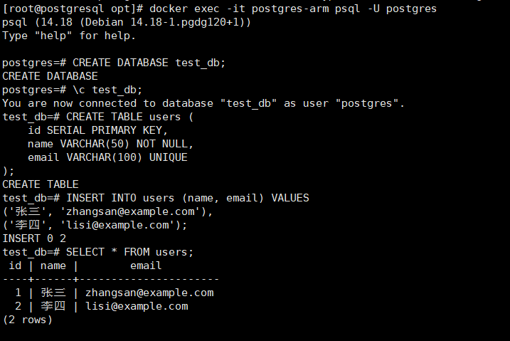

# PostgreSQL数据库使用指南

# 一、商品链接

[PostgreSQL数据库](https://marketplace.huaweicloud.com/hidden/contents/42d1df14-d3e7-435d-9b20-281335a57634#productid=OFFI1164386440709509120)

# 二、商品说明

PostgreSQL 是一款‌开源对象-关系型数据库管理系统‌（ORDBMS），起源于 1986 年加州大学伯克利分校的 POSTGRES 项目，1996 年正式更名为 PostgreSQL。其以可靠性、功能完备性和高度兼容 SQL 标准著称，支持 ACID 事务、复杂查询、外键约束、触发器等核心特性。。本商品基于鲲鹏服务器的Huawei Cloud EulerOS 2.0 64bit系统，提供开箱即用的PostgreSQL数据库。

# 三、商品购买

您可以在云商店搜索 **PostgreSQL数据库**。

其中，地域、规格、推荐配置使用默认，购买方式根据您的需求选择按需/按月/按年，短期使用推荐按需，长期使用推荐按月/按年，确认配置后点击“立即购买”。


# 3.1ECS 控制台配置

### 准备工作

在使用ECS控制台配置前，需要您提前配置好 **安全组规则**。

> **安全组规则的配置如下：**
> - 入方向规则放通端口5432，源地址内必须包含您的客户端ip，否则无法访问
> - 入方向规则放通 CloudShell 连接实例使用的端口 `22`，以便在控制台登录调试
> - 出方向规则一键放通

### 创建ECS

前提工作准备好后，选择 ECS 控制台配置跳转到[购买ECS](https://support.huaweicloud.com/qs-ecs/ecs_01_0103.html) 页面，ECS 资源的配置如下图所示：

选择CPU架构

选择服务器规格

选择镜像

其他参数根据实际请客进行填写，填写完成之后，点击立即购买即可


> **值得注意的是：**
> - VPC 您可以自行创建
> - 安全组选择 [**准备工作**](#准备工作) 中配置的安全组；
> - 弹性公网IP选择现在购买，推荐选择“按流量计费”，带宽大小可设置为5Mbit/s；
> - 高级配置需要在高级选项支持注入自定义数据，所以登录凭证不能选择“密码”，选择创建后设置；
> - 其余默认或按规则填写即可。

# 商品使用

## PostgreSQL数据库使用

### 容器内连接测试
执行以下命令，连接PostgreSQL
```bash
docker exec -it postgres-arm psql -U postgres
```
在PostgreSQL命令行内执行
```bash
// 创建测试数据库
CREATE DATABASE test_db;
// 切换数据库
\c test_db;
// 创建表
CREATE TABLE users (
id SERIAL PRIMARY KEY,
name VARCHAR(50) NOT NULL,
email VARCHAR(100) UNIQUE
);
// 插入数据
INSERT INTO users (name, email) VALUES
('张三', 'zhangsan@example.com'),
('李四', 'lisi@example.com');
// 查询测试数据
SELECT * FROM users;
```

### 参考文档
[postgresql官网](https://www.postgresql.org/)
